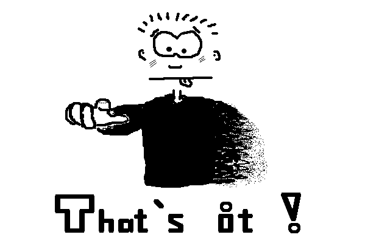
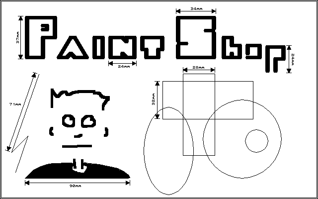

# Atari TOS/GEM Image Reader

This is a small Java library with ImageIO plugins (readers) for some really old Atari TOS/GEM image
file formats. And of course it is a fun project to preserve my very first (IIRC) two
[Java applets](https://snailshell.de/java.html) from 1996, buried somewhere in the
[Git history](https://github.com/thmuch/tosgem-image-reader/tree/1996-08) :-)

## Supported image formats

- Monochrome GEM images (["GEM Raster"](http://fileformats.archiveteam.org/wiki/GEM_Raster),
  file extension \*.IMG)
- Monochrome GEM 32000 bytes 640x400 images (["Doodle"](http://fileformats.archiveteam.org/wiki/Doodle_(Atari)),
  file extension \*.PIC or \*.DOO)
- Monochrome [STAD-PAC](http://fileformats.archiveteam.org/wiki/STAD_PAC) images (file extension \*.PAC)
- Monochrome [**P**aint**S**hop **C**ompressed](http://fileformats.archiveteam.org/wiki/PaintShop_(Atari_ST))
  images (file extension \*.PSC). PSC was the native image format of my TOS application "PaintShop"
  that I wrote 1989-1991. The file format is documented in detail [here](docs/PaintShopCompressed.md).

## Command Line Interface (CLI)

The library offers a very simple command line interface to convert an input file into a destination format:

`java -jar tosgem-image-reader.jar <output-format> <input-file>`

For example:

`java -jar tosgem-image-reader.jar png poster.psc`

If you don't have any additional ImageIO writers on the classpath, the possible standard output formats are
`bmp`, `gif`, `jpg`, `png` and `tif`.

The converted image file is created in the same folder as the input file.

## TODO

- The algorithms in `GEMImage` and `GEMPicture` certainly need some refactoring. But for the time being,
  I kept the structures close to their originals from 1996.

## Getting Started

- The (integrated) [tests](src/test/java/de/snailshell/imageio/) offer an overview of how to use
  the new readers via ImageIO API.
- The reader (decoder) implementations offer a deep dive into the algorithms for
  [IMG](src/main/java/de/snailshell/imageio/img/GEMImage.java),
  [PIC](src/main/java/de/snailshell/imageio/pic/GEMPicture.java) and
  [PSC](src/main/java/de/snailshell/imageio/psc/PSCompressed.java).
- A good starting point for ImageIO integration is the
  [services SPI file](src/main/resources/META-INF/services/javax.imageio.spi.ImageReaderSpi).
- This project uses Java 15 (including some of the new syntax features). But backporting the code
  to older Java versions should not be that difficult.

## Credits

- "tiger.img" apparently belongs to the public domain, so thank you whoever created that picture!
- "poster.pic" was drawn by my cousin [Sebastian Mayer](https://www.sebastianmayer.com/) with an early
  version of my TOS application ["PaintShop"](https://www.atariuptodate.de/en/675/paintshop-plus)
  (and exported as a GEM PIC file afterwards).

